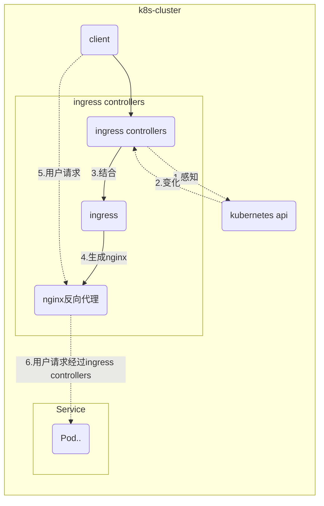
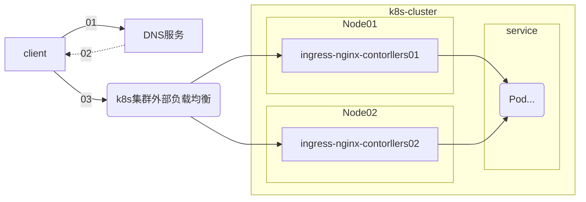

# 集群入口 ingress-nginx

####写在前面的总结：

* ingress 可以和 controllers 不在一个namespace

* 但是ingress绝对要和转发的service在同一个namespace、否则找不到声明的service

* 一个集群内可以部署多个ingress、一个controllers可以匹配多个ingress


ingress-nginx-controllers  是k8s集群的入口、负责集群内部所有`service`的智能路由。

但是在k8s集群内部也是作为一种资源存在、ingress-nginx-controllers服务`service`本身也需要暴露在集群外部、才能作为集群的流量入口

查询各个文档、关于ingress的暴露方式，目前看来有两种

* hostNetwork  这个应该是网络开销损耗最小的方式（目前没试过）
* externalIPs  直接绑定k8s集群内的服务器（DNS解析域名到服务器即可）

由于ingress的重要性，在阿里云的容器平台实践中，建议ingress 独占节点。

实现原理请参考`Kubernetes内部服务如何被外部访问`的分析章节，这里在梳理一遍。ingress-nginx包括下面这三个组件

* ingress-controllers：和kube-api 交互，感知集群内seivice、Pod变化，结合ingress规则生成配置、更新nginx方向代理，实现动态更新和发现

* ingress：就是一种规则描述、定义域名和Service的关系。

* nginx反向代理：嗯就是个反向代理

####ingress-nginx原理思维导图：



#### 系统架构角度




####从配置角度ingress和controllers的关系：

在定义Ingress 资源时，可以通过下面的配置制定controllers：

```yaml
apiVersion: extensions/v1beta1
kind: Ingress
metadata:
  name: nginx-ingress      
  namespace: ingress-nginx      
  annotations:
    kubernetes.io/ingress.class: "nginx"  # 指定ingress.class为nginx
```

然后在controllers启动参数中指定`--ingress-class=nginx`

```yaml
args:
  - /nginx-ingress-controller
  ...
  - --ingress-class=nginx
```

> 这样定义controllers就只会监听`kubernetes.io/ingress.class`为nginx的ingress资源了。默认当然不用改任何东西，但是一般集群中难免会有多个入口的需求，所以通过这种方式可以实现

在实际的环境中，我们的Service会位于不同的namespace中，需要注意的是ingress必须被定义在Service所在的namespace中，否则会找不到后端Service。

##ingress-nginx 运维

#### 部署

```shell
helm fetch stable/nginx-ingress
#修改部署nginx-ingress用到的image
cd nginx-ingress/
vim values.yaml  
# 将repository后面的地址更换为国内地址
# type: LoadBalancer 更改为 type: ClusterIP
# 添加值 externalIPs: ['192.168.10.247','192.168.10.247','192.168.10.249']
helm install . --name nginx-ingress --set rbac.create=true
```

> externalIPs IP地址必须是k8s集群内部的服务器、使用externalIPs的方式

```bash
POD_NAME=$(kubectl get pods -l app=nginx-ingress -o jsonpath={.items[0].metadata.name})
kubectl exec -it $POD_NAME -- /nginx-ingress-controller --version
```

> 查看部署结果

#### 增加TLS/HTTPS支持

可以使用以下命令生成自签名证书和私钥：

```bash
openssl req -x509 -nodes -days 365 -newkey rsa:2048 -keyout ${KEY_FILE} -out ${CERT_FILE} -subj "/CN=${HOST}/O=${HOST}"`
```

然后通过以下方式在集群中创建密钥：

```bash
kubectl create secret tls ${CERT_NAME} --key ${KEY_FILE} --cert ${CERT_FILE}
```

> 这样生成的secret 类型是`kubernetes.io/tls`，然后直接引用即可

在证书颁发机构购买的合规证书：

官方要求证书编码是base64的，所以需要将购买到的证书转换。

```bash
openssl rsa -in xxx.key -text > key.pem
openssl x509 -inform PEM -in yyy.crt > cert.pem
```

在集群中创建secret

```bash
kubectl create secret tls example-tls --key tls/key.pem --cert tls/cert.pem
```

在ingress规则配置文件中加入以下代码即可：

```yaml
   ...
   tls:
        - hosts:
            - www.example.com
          secretName: example-tls
   ...
```

#### 访问出现503错误

将域名解析到ingress的externalIPs后（通过DNS服务、/etc/hosts文件都可以），访问出现`503 Service Temporarily Unavailable `错误代码

这种情况可以通过ingress controllers的日志来排查问题

```bash
kubectl  logs -f my-nginx-nginx-ingress-xxxxx
```

> （图丢了）原因是ingress controllers没找到 kube-dashboard服务，问题是ingress controllers在default 命名空间没有找到该服务，根据前面的文档我们的kube-dashboard服务在kube-system 命名空间
>
> 所以ingress 规则必须定义在service所在的namespace


解决503之后，访问又出现`ERR_SPDY_PROTOCOL_ERROR` 错误

> （图丢了）原因是dashboard serivce 必须使用https的方式访问，但是ingress的https请求到controllers之后转发到后端服务的时候使用的是http://的方式，所以无法访问。
>
> 解决方法是ingress-controllers开启`ssl-passthrough` SSL穿透功能，[参考](https://github.com/kubernetes/ingress-nginx/blob/master/docs/user-guide/tls.md) （没用过）
>
> 在ingress描述文件中设置 `nginx.ingress.kubernetes.io/secure-backends` 功能为true [参考](https://github.com/kubernetes/ingress-nginx/blob/5e4137c6e7f4a6cea91be7fc179ff680c647d5fd/docs/user-guide/nginx-configuration/annotations.md)（使用）

#### 后端服务需要302跳转

在后端service工作在在非`/`路径下，比如直接访问服务`http://x.com`的时候会自动302跳转到`http://x.com/welcome`。也就是说后端service真正工作在`/welcome`路径下，直接访问时会自动帮你302跳转。但是ingress-nginx 默认是不会302的，所以需要在ingress 资源文件添加额外的`annotations`注释:

```yaml
apiVersion: extensions/v1beta1
kind: Ingress
metadata:
  name: k8s-prometheus
  namespace: monitoring
  annotations:
    kubernetes.io/ingress.class: "nginx"
    nginx.ingress.kubernetes.io/app-root: "graph" #设置service根路径
```

> `nginx.ingress.kubernetes.io/app-root`定义nginx-controllers需要重定向到的应用程序的根目录
>
> 更多的rewrite参数和信息请参考[连接](https://kubernetes.github.io/ingress-nginx/examples/rewrite/README/)

####一个完整的单域名Ingress资源描述

```yaml
apiVersion: extensions/v1beta1
kind: Ingress
metadata:
  name: k8s-dashboard
  namespace: kube-system
  annotations:
    kubernetes.io/ingress.class: "nginx"
    nginx.ingress.kubernetes.io/secure-backends: "true"  # 支持后端https
spec:
  rules:
  - host: k8s-dashboard.xingshulin.com
    http:
      paths:
      - backend:
          serviceName: kubernetes-dashboard
          servicePort: 8443
  tls:
    - hosts:
        - k8s-dashboard.xingshulin.com
      secretName: example-tls
```

####升级和回滚ingress-nginx-controllers

```bash
# 升级
root@k8s01:/apps/k8s/nginx-ingress# helm upgrade nginx-ingress .  
root@k8s01:/apps/k8s/nginx-ingress#
root@k8s01:/apps/k8s/nginx-ingress# helm history my-nginx
REVISION	UPDATED                 	STATUS  	CHART               	DESCRIPTION
1       	Tue Jul 31 17:40:01 2018	DEPLOYED	nginx-ingress-0.23.0	Install complete
2       	Tue Jul 31 18:16:19 2018	FAILED  	nginx-ingress-0.23.0	Upgrade "my-nginx" failed: Service "my-nginx-nginx-ingres...
# 回滚
root@k8s01:/apps/k8s/nginx-ingress# helm  rollback my-nginx 1
Rollback was a success! Happy Helming!
root@k8s01:/apps/k8s/nginx-ingress# helm history my-nginx
REVISION	UPDATED                 	STATUS    	CHART               	DESCRIPTION
1       	Tue Jul 31 17:40:01 2018	SUPERSEDED	nginx-ingress-0.23.0	Install complete
2       	Tue Jul 31 18:16:19 2018	FAILED    	nginx-ingress-0.23.0	Upgrade "my-nginx" failed: Service "my-nginx-nginx-ingres...
3       	Tue Jul 31 18:19:01 2018	DEPLOYED  	nginx-ingress-0.23.0	Rollback to 1
```

####删除和清理

```bash
helm delete --purge my-nginx
```

#### 指定ingress-nginx-controllers部署位置

在使用`hostNetwork`的情况下，每次重新调度后、Pod所在的节点也许就会变化，DNS解析和`/etc/hosts`配置就会失效，为解决这样的问题可以将ingress-nginx-controllers部署到指定节点，这样每次重新调度就会

```yaml
nodeSelector:                   # 指定Ingress Controller调度到某个节点
  nodeName: NodeName 
```


------

本文档只实践了`externalIPs`的方式，还有`hostNetwork`的方式，网络层面上这种方式、理论上会比`externalIPs`方式效率更高、因为nginx Controller直接使用主机的80、443端口，免去了`kube-proxy`的转发、少一层转发就会多一点效率。后期会实践一下。

文档内容偏多、杂、但是基本有理可循。请耐心看完会有很大收获。

有参考价值文档：

官方文档：https://kubernetes.github.io/ingress-nginx

github仓库：https://github.com/kubernetes/ingress-nginx/tree/master/docs