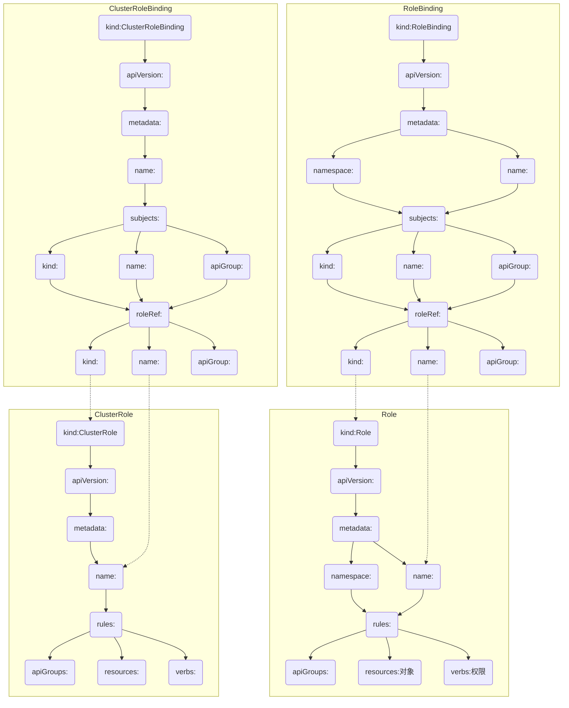

## RBAC

全称为Role Based Access Control，基于角色访问控制。

有四种基本类型：

* Role

  表示一组规则，授权权限仅限于一个`namespace`中。一个Role只能描述一个`namespace`中的资源

* Cluster Role

  与Role一致表示一组规则，但是描述的资源范围扩大到集群层面，可以描述跨`namespace`的资源、集群范围内的资源、非资源的对象（一些接口）

* Role Binding

  将`Role`中定义的规则授予一个组`Group`、或者用户`User`、或者服务账户`Service Account`。这些对象统称为`subject`，`Role Binding`引用`Role`与`subject`进行关联。只限于`namespace`内部。

* Cluster Role binding

  同`Role Binding`一样，只是`ClusterRoleBinding`可描述的资源更丰富。一般是集群范围的权限授予。


四种类型基本关系图：

```mermaid
graph TD
subgraph 集群范围内的权限控制
ClusterRolebinding(4.ClusterRolebinding) --> |引用| ClusterRole(3.ClusterRole)
end
subgraph 更多作用于用户,组,Service Accout
RoleBinding(2.RoleBinding) -->|引用| Role(1.Role)
end
RoleBinding(2.RoleBinding) -.-> |也可以引用| ClusterRole(3.ClusterRole)
```


### Role描述语法：

```yaml
kind: Role
apiVersion: rbac.authorization.k8s.io/v1beta1
metadata:
  namespace: default
  name: pod-reader
rules:
- apiGroups: [""] # 空字符串""表明使用core API group
  resources: ["pods"]
  verbs: ["get", "watch", "list"]
```

> `Kind:`定义资源类型，在此处有上面说到的四种基本类型。
>
> `apiVersion:`一般都是`rbac.authorization.k8s.io/v1beta1`
>
> `metadata:`包含`namespace`和`name`两个配置
>
> `rule:`包含`resources:`、`verbs` 、前者描述资源、后者描述权限。`apiGroups`默认即可


### ClusterRole描述语法：

```yaml
kind: ClusterRole
apiVersion: rbac.authorization.k8s.io/v1beta1
metadata:
  # 鉴于ClusterRole是集群范围对象，所以这里不需要定义"namespace"字段
  name: secret-reader
rules:
- apiGroups: [""]
  resources: ["secrets"]
  verbs: ["get", "watch", "list"]
```

> 基本和`Role`定义语法一致，不一样的地方是：
>
> `kind:`定义的资源类型为`ClusterRole`
>
> `metadata:`少了`namespace`配置、因为限定对象是集群内的资源

### RoleBinding描述语法：

`RoleBinding`的作用就是将前面`Role`定义的规则绑定到相应的`User`、`Group`、`Service Account`。

```yaml
kind: RoleBinding
apiVersion: rbac.authorization.k8s.io/v1beta1
metadata: # 定义范围
  name: read-pods
  namespace: default
subjects: # 主体
- kind: User
  name: jane
  apiGroup: rbac.authorization.k8s.io
roleRef: # 授权
  kind: Role
  name: pod-reader
  apiGroup: rbac.authorization.k8s.io
```

> 定义了User用户`jane`主体在`namespace`范围`default`内具有`Role`定义的`pod-reader`权限
>
> 新增的两个配置：`subjects`、`roleRef`：
>
> `subjects:`描述的是授权对象（绑定主体），用过`kind`指定对象资源为`User`
>
> `roleRef`: 绑定之前定义的`Role`

### ClusterRoleBinding描述语法：

```bash
kind: ClusterRoleBinding
apiVersion: rbac.authorization.k8s.io/v1beta1
metadata:
  name: read-secrets-global
subjects:
- kind: Group
  name: manager
  apiGroup: rbac.authorization.k8s.io
roleRef:
  kind: ClusterRole
  name: secret-reader
  apiGroup: rbac.authorization.k8s.io
```

> 以上定义了Group用户组`manager`可以读取任意`namespace`的`secret`
>
> kind改变为`ClusterRoleBinding`、metadata少了`namespace`配置


### 语法关系图


