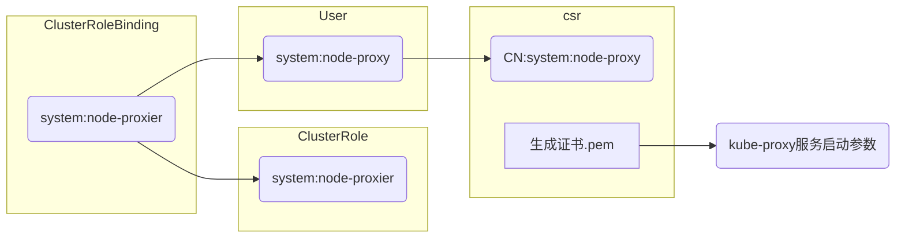

## 生成证书

### 摘要

证书请求文件中的`CN`、`O`标识可以被理解为、<a href="../../doc/权限控制/RBAC.md">RBAC</a>中`RoleBinding`和`ClusterRoleBinding`提到的被授权的主体、对象 。`CN`在RBAC中被识别为User Name、`O` 会被识别为 Group。

第一步： 生成根证书

第二部：由根证书颁发各个服务的使用到的证书

服务证书使用对应关系表：

| 服务                               | 证书                                       | 位于节点 |
| ---------------------------------- | :----------------------------------------- | -------- |
| kube-apiserver                     | ca.pem、kubernetes.pem、kubernetes-key.pem | Master   |
| kube-scheduler                     |                                            | Master   |
| kube-controller-manager            | ca.pem、ca-key.pem                         | Master   |
| kubelet                            | ca.pem                                     | Node     |
| kube-proxy                         | ca.pem、kube-proxy.pem、kube-proxy-key.pem | Node     |
| kubectl                            | ca.pem、admin.pem、admin-key.pem           | Manager  |
| etcd、flannel 服务均不采用证书部署 |                                            |          |

> * apiserver、scheduler、controller-manager、三个服务在同一台服务上、可以使用本地127.0.0.1非TLS方式通信
> * kubelet 证书是由node节点`tls bootstrap`向 `api server`请求、由`controller-manger`自动签发，包含服务器证书和客户端证书

### 下载证书工具


```bash
cd /usr/local/bin/
wget https://pkg.cfssl.org/R1.2/cfssl_linux-amd64 -O ./cfssl
wget https://pkg.cfssl.org/R1.2/cfssljson_linux-amd64 -O ./cfssljson
wget https://pkg.cfssl.org/R1.2/cfssl-certinfo_linux-amd64 -O ./cfssl-certinfo
chmod +x ./cf·ssl*
```

### 创建CA、根证书

创建CA证书配置文件 ca-config.json  、ca-csr.json 

```bash
# ca-config.json
cd ~/k8s-install-tls/gen-ca/ca-conf/
cat ca-config.json 
{
    "signing": {
        "default": {
            "expiry": "87600h"
        },
        "profiles": {
            "kubernetes": {
                "expiry": "87600h",
                "usages": [
                    "signing",
                    "key encipherment",
                    "server auth",
                    "client auth"
                ]
            }
        }
    }
}
```

```bash
# ca-csr.json
cd ~/k8s/k8s-install-tls/gen-ca/ca-conf/
cat ca-csr.json
{
    "CN": "kubernetes",
    "key": {
        "algo": "rsa",
        "size": 2048
    },
    "names": [
        {
            "C": "CN",
            "L": "BeiJing",
            "ST": "BeiJing",
            "O": "k8s",
            "OU": "System"
        }
    ]
}
```

> CN： 可以看做是用户名、User Name
>
> O： 用户所属的组 Group
>
> User 、Group 将会被作为RBAC的授权标识、就是<a href="../../doc/权限控制/README.md">权限控制</a>提到的"主体对象"

生成CA证书和私钥

```bash
cfssl gencert -initca ca-csr.json | cfssljson -bare ca
```

### kubernetes证书

#### 生成命令

```bash
root@k8s01:/k8s-install-tls/gen-ca/ssl-conf# cfssl gencert -ca=./ca.pem -ca-key=./ca-key.pem -config=./ca-config.json -profile=kubernetes ./kubernetes-csr.json | cfssljson -bare kubernetes
2018/06/15 15:42:51 [INFO] generate received request
2018/06/15 15:42:51 [INFO] received CSR
2018/06/15 15:42:51 [INFO] generating key: rsa-4096
2018/06/15 15:42:59 [INFO] encoded CSR
2018/06/15 15:42:59 [INFO] signed certificate with serial number 511064954877940838098909237068310625027718122795
2018/06/15 15:42:59 [WARNING] This certificate lacks a "hosts" field. This makes it unsuitable for
websites. For more information see the Baseline Requirements for the Issuance and Management
of Publicly-Trusted Certificates, v.1.1.6, from the CA/Browser Forum (https://cabforum.org);
specifically, section 10.2.3 ("Information Requirements").
```

#### kubernetes证书详解

kubernetes是服务器证书、指定host标志内容声明使用该证书的IP或域名、主要功能是保护的kube-apiserver的安全

证书请求文件

```yaml
{
    "CN": "kubernetes",
    "hosts": [
        "127.0.0.1",
        "192.168.10.249",
        "192.168.10.248",
        "192.168.10.247",
        "10.211.0.1",
        "kubernetes",
        "kubernetes.default",
        "kubernetes.default.svc",
        "kubernetes.default.svc.cluster",
        "kubernetes.default.svc.cluster.local"
    ],
    "key": {
        "algo": "rsa",
        "size": 4096
    },
    "names": [
        {
            "C": "CN",
            "ST": "BeiJing",
            "L": "BeiJing",
            "O": "k8s",
            "OU": "System"
        }
    ]
}

```

> `hosts` 字段声明了该证书会被用于那些节点，当证书被应用非`hosts`限定范围内节点、就会没有权限、保证了服务的安全性

### kube-proxy 证书

#### 生成命令

```bash
root@k8s01:/k8s-install-tls/gen-ca/ssl-conf# cfssl gencert -ca=./ca.pem -ca-key=./ca-key.pem -config=./ca-config.json -profile=kubernetes ./kube-proxy-csr.json | cfssljson -bare kube-proxy
2018/06/15 15:50:13 [INFO] generate received request
2018/06/15 15:50:13 [INFO] received CSR
2018/06/15 15:50:13 [INFO] generating key: rsa-4096
2018/06/15 15:50:23 [INFO] encoded CSR
2018/06/15 15:50:23 [INFO] signed certificate with serial number 439818088453367013715031387250535834446574166159
2018/06/15 15:50:23 [WARNING] This certificate lacks a "hosts" field. This makes it unsuitable for
websites. For more information see the Baseline Requirements for the Issuance and Management
of Publicly-Trusted Certificates, v.1.1.6, from the CA/Browser Forum (https://cabforum.org);
specifically, section 10.2.3 ("Information Requirements").

```

#### kube-proxy证书详解

kube-proxy证书主要用于集群服务kube-proxy服务想kube-apiserver注册时使用、证书的`CN`声明、指定了证书的User为`system:kube-proxy`，集群内部预定义的ClusterRoleBinding `system:node-proxier`将User`system:kube-proxy`和ClusterRole `system:node-proxier`绑定、授予了该证书条用kube-apiserver Proxy的API相关权限

证书请求文件

```yaml
{
    "CN": "system:kube-proxy",
    "hosts": [ ],
    "key": {
        "algo": "rsa",
        "size": 4096
    },
    "names": [
        {
            "C": "CN",
            "ST": "BeiJing",
            "L": "BeiJing",
            "O": "k8s",
            "OU": "System"
        }
    ]
}
```

> CN 为 system:kube-proxy、和集群预定义的ClusterRoleBinding 配合、实现对该证书的授权

#### RBAC详情

```bash
root@k8s01:~# kubectl describe clusterrolebinding system:node-proxier
Name:         system:node-proxier # 内置 clusterrolebinding 名
Labels:       kubernetes.io/bootstrapping=rbac-defaults
Annotations:  rbac.authorization.kubernetes.io/autoupdate=true
Role:
  Kind:  ClusterRole # 绑定角色
  Name:  system:node-proxier # 绑定角色名
Subjects:
  Kind  Name               Namespace
  ----  ----               ---------
  User  system:kube-proxy # 被绑定对象(此处指csr文件中的CN标志内容)
```


#### 关系拓扑



### metrics-server 证书

```bash
root@k8s01:/etc/kubernetes/ssl# cfssl gencert -ca=./ca.pem  -ca-key=./ca-key.pem -config=./ca-config.json  -profile=kubernetes  metrics-server-csr.json | cfssljson  -bare metrics-server
2018/06/22 14:31:31 [INFO] generate received request
2018/06/22 14:31:31 [INFO] received CSR
2018/06/22 14:31:31 [INFO] generating key: rsa-2048
2018/06/22 14:31:33 [INFO] encoded CSR
2018/06/22 14:31:33 [INFO] signed certificate with serial number 637479601437315879178405979638122928357885786516
2018/06/22 14:31:33 [WARNING] This certificate lacks a "hosts" field. This makes it unsuitable for
websites. For more information see the Baseline Requirements for the Issuance and Management
of Publicly-Trusted Certificates, v.1.1.6, from the CA/Browser Forum (https://cabforum.org);
specifically, section 10.2.3 ("Information Requirements").
```


### Admin 证书

#### 生成命令

```bash
root@k8s01:/k8s-install-tls/gen-ca/ssl-conf# cfssl gencert -ca=./ca.pem -ca-key=./ca-key.pem -config=./ca-config.json -profile=kubernetes admin-csr.json | cfssljson -bare admin
2018/06/21 17:08:53 [INFO] generate received request
2018/06/21 17:08:53 [INFO] received CSR
2018/06/21 17:08:53 [INFO] generating key: rsa-2048
2018/06/21 17:08:54 [INFO] encoded CSR
2018/06/21 17:08:54 [INFO] signed certificate with serial number 534091525587758072784575750985426836880405389670
2018/06/21 17:08:54 [WARNING] This certificate lacks a "hosts" field. This makes it unsuitable for
websites. For more information see the Baseline Requirements for the Issuance and Management
of Publicly-Trusted Certificates, v.1.1.6, from the CA/Browser Forum (https://cabforum.org);
specifically, section 10.2.3 ("Information Requirements").
```

#### Admin证书详解

Admin 证书在目前主要用于给kubelet命令授权、通过证书内容中`O`声明与kubernetes集群内置RBAC策略ClusterRoleBinding、将`O`声明的Group`system:master`和ClusterRole`cluster-admin`关联、然后手动配置kubeconfig文件、为kubelet实现授权

证书请求文件

```json
{
  "CN": "admin",
  "hosts": [],
  "key": {
    "algo": "rsa",
    "size": 2048
  },
  "names": [
    {
      "C": "CN",
      "ST": "BeiJing",
      "L": "BeiJing",
      "O": "system:masters",
      "OU": "System"
    }
  ]
}

```

> 此文件的`O`标志即指定了该证书的Groups为`system:master`、后面会利用kubernetes集群的RBAC权限控制策略ClusterRoleBinding、将Group`system:master`和ClusterRole`cluster-admin`进行绑定。后面在利用该证书生成kubeconfig、kubectl使用该kubeconfig文件、完成对kubectl的命令配置

#### RBAC详情

```bash
root@k8s01:~# kubectl describe clusterrolebinding cluster-admin
Name:         cluster-admin # ClusterRoleBinding 名
Labels:       kubernetes.io/bootstrapping=rbac-defaults
Annotations:  rbac.authorization.kubernetes.io/autoupdate=true
Role:
  Kind:  ClusterRole # 绑定的角色
  Name:  cluster-admin # 绑定的角色的名
Subjects:
  Kind   Name            Namespace
  ----   ----            ---------
  Group  system:masters # 被授权的对象(此处指csr文件O标志的内容)
```

#### 关系拓扑

```mermaid
graph LR
subgraph csr.json
O("O:system:master")
生成证书.pem
end
subgraph ClusterRole
cluster-admin01(cluster-admin)
end
subgraph ClusterRoleBinding
cluster-admin02(cluster-admin)
end
subgraph Group
system:masters("system:masters")
end
subgraph kubeconfig
kubeconfig
end
kubectl((kubectl))
cluster-admin02 --> |绑定| cluster-admin01
cluster-admin02 --> |绑定| system:masters
system:masters -->|对应| O
生成证书.pem --> |被引用| kubeconfig
kubeconfig -->|被引用| kubectl
```

### 注解

ca-config.json 是CA证书的配置文件、定义根证书、CA的使用场景(profile)，和具体参数

| 证书请求文件        | CN                | O              |
| ------------------- | ----------------- | -------------- |
| ca-csr.json         | kubernetes        | k8s            |
| admin-csr.json      | admin             | system:masters |
| kubernetes-csr.json | kubernetes        | k8s            |
| kube-proxy-csr.json | system:kube-proxy | k8s            |

> 证书请求文件在[ssl-conf](https://github.com/lijiapengsa/k8s/tree/master/k8s-install-tls/gen-ca/ssl-conf) 目录

在这个[文档](https://coreos.com/os/docs/latest/generate-self-signed-certificates.html)中、提到了证书类型（按使用方法区分的），分为三种，在Kubernetes集群内部基本上也是这三种：

* 客户端证书、通过服务器验证客户端身份。kubectl
* 服务端证书、在服务器上使用、由客户端验证服务器身份。kube-apiserver
* 对等证书、不知道怎么解释，etcd、flannel会用到，但是在本文档这两个组件没用TLS的方式...


参考：

https://kubernetes.io/docs/concepts/cluster-administration/certificates/

https://kubernetes.io/docs/tasks/tls/managing-tls-in-a-cluster/

